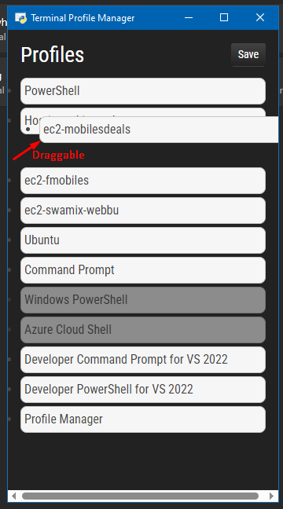

# Terminal Profile Manager

## Introduction

Python script that utilizes the webview library to create a window and display an HTML interface for managing Terminal profiles, a hacky fix for issue
https://github.com/microsoft/terminal/issues/8914. The script "intelligently" reads the settings file of the Windows Terminal app to retrieve the existing profiles and allows the
user to reorder them. The modified profiles are then saved back to the settings file. since terminal watches this file, it will reload the profiles automagically!

## Features

- drag and drop profiles to reorder them, and save the new order to the settings file.
- intelligently read settings from `AppData/Local` folder irrespective of user name.
- color theme matched to windows terminal dark mode.
- edit/extend logic using simple python code and change GUI using html and css.
- if python already installed, half the setup is done.
- jquery, jquery-UI and bootstrap used for GUI. Keyboard support in future.
- hidden profiles explicitly dimmed.

## Prerequisites

Before running the script, please make sure you have the following prerequisites installed:

- Python (3.10 or higher, may work with lower versions you can try and report)
- run `pip install -r requirements.txt` and try running
- winget package manager for getting dotnet on the fly | dont want to install , then use https://dotnet.microsoft.com/en-us/download need dotnet 5.0 or higher may work with lower
  versions.

## Usage

To use the PowerShell Manager script, follow these steps:

1. try running launcher.pyw, if it works, you can skip to step 4.
2. Run the script using `python script.py`.
3. The PowerShell Manager window will open, displaying the profiles in the Windows Terminal settings file.
4. Reorder the profiles by dragging and dropping them.
5. Click the "Save" button to save the new profile order to the settings file.
6. use install-in-terminal.py to install it right in terminal! 

## Configuration

The Profile Manager script includes the following configuration options:

- `width` and `height`: Set the width and height of the window displayed by the webview library.
- `debug`: Set to True to enable debug mode for webview.
- styles have been kept similar to windows terminal, also you can change the styles in the styles.css file.

## Bugs and Limitations

- pythonnet has some strange issue, when i tried to rip it to exe file using py2exe, it was not working, and using pyinstaller had partial success. if you know any fixes, please
  let me know. or send pr! ref https://github.com/pythonnet/pythonnet/issues/1728
- currently tested for windows only, sorry 😅 you need to change few lines and find the settings.json in linux and macos and the logic should work.

### Urgent Notice!

#### im looking for a job, if you have any openings, please contact! if ur a dev, please give a referral. contacts in resume.

RESUME : https://docs.google.com/document/d/e/2PACX-1vRvk0ZEqt71qmJDJi-rhPt7zd4Aq3l7gN87BJjEKFZmNK4SQZTbSOKmg3T2OGd-D_SYyMYn3YjibVRj/pub
