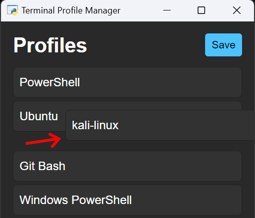

# Terminal Profile Manager

## Introduction

Python script that utilizes the [`pywebview`](https://pywebview.flowrl.com/) library to which gives the user the ability to manage Terminal profiles using `drag-and-drop` style, a
hacky fix for issue [`#8914`](https://github.com/microsoft/terminal/issues/8914).

## How It Works?

The script "intelligently" reads the settings file of the Terminal app to retrieve the existing profiles and allows the user to reorder them. The modified profiles are then saved
back to the settings file. Since terminal watches this file, it will reload the profiles automagically!

## Features

-   Drag and drop profiles to reorder them, and save the new order to the settings file.
-   Intelligently read settings from `[...]AppData/Local[...]/settings.json` folder irrespective of user name or depend on any static paths.
-   Color theme matched to Windows Terminal dark mode.
-   Edit/extend logic using simple Python code and change GUI using HTML and CSS.
-   Requires only python 3.10 or greater to be installed.
-   jQuery, jQuery-UI and Bootstrap 5 used for GUI.
-   Hidden profiles explicitly dimmed.

## Prerequisites

Before running the script, you will be required to:

-   Install Python 3.10 or higher _(lower versions may work, you can try and report)_
-   While the program is self sufficient to install dependencies, you can install them manually using `pip install -r requirements.txt` in the project directory. Please note Dotnet
    is shipped with many applications, you may already have it installed. so just try running the script first.
-   `winget` package manager for installing dotnet on the fly. If you don't have `winget` get it from
    [here](https://learn.microsoft.com/en-us/windows/package-manager/winget/#install-winget), else you can directly install official dotnet from
    [here](https://dotnet.microsoft.com/en-us/download) (skipping winget).

## Usage

To use the PowerShell Manager script, follow these steps:

1. Try running `launcher.pyw` if you have completed the setup else run `launcher.cmd` which launches in terminal and attempts installing dependencies, press `y` to install.
2. Now you can try double clicking `launcher.pyw`.
3. The app will now open in a mini window (like the intro image of this repo) displaying the profiles in the same order as your previous settings.
4. Reorder the profiles by dragging and dropping them, just like you would with browser tabs.
5. Click the "Save" button to save the new profile order to the settings file. And changes will be reflected instantly!
6. Use `install-in-terminal.py` to install it right in terminal! 

## Configuration

The Profile Manager script includes the following configuration options:

-   `width` and `height`: Set the width and height of the window displayed by the `webview` library.
-   `debug`: Set to True to enable debug mode for `webview`.
-   Styles have been kept similar to Windows Terminal, also you can change the styles in the `assets/styles.css` file.

## Roadmap and Improvements

-   Double click to launch profile
-   Add a "New" button to create a new profile
-   Show/Hide Toggle button
-   Delete Profile button
-   Add a "Rename"/"edit" button to for seamless experience.
-   Add custom icons from flaticons or other vector icons site, using URL or local file path.

## Bugs and Limitations

-   `pythonnet` has some strange issue, when i tried to rip it to exe file using `py2exe`, it was not working, and using `pyinstaller` had partial success. if you know any fixes,
    please let me know, or send a PR addressing [this issue.](https://github.com/pythonnet/pythonnet/issues/1728)
-   Since Terminal is a windows only app, this script is also windows only. however the project can be extended with a little effort to support other terminals like tabby, etc.
-   Be **careful** if you previously opened the settings file in any editor, it might be in use, so close it before running the script. and also avoid creating duplicate profiles.

### Urgent Notice!

#### im looking for a job, if you have any openings, please contact! if ur a dev, please give a referral. contacts in resume.

RESUME : https://docs.google.com/document/d/e/2PACX-1vRvk0ZEqt71qmJDJi-rhPt7zd4Aq3l7gN87BJjEKFZmNK4SQZTbSOKmg3T2OGd-D_SYyMYn3YjibVRj/pub
